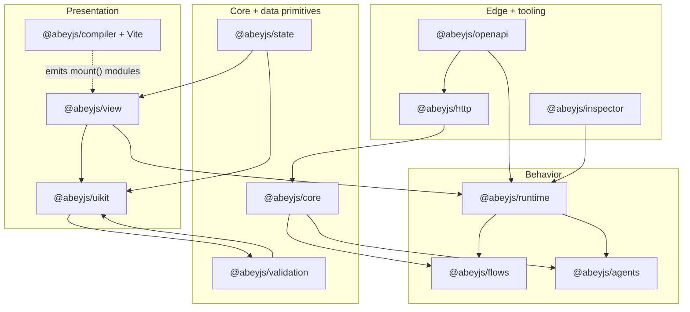
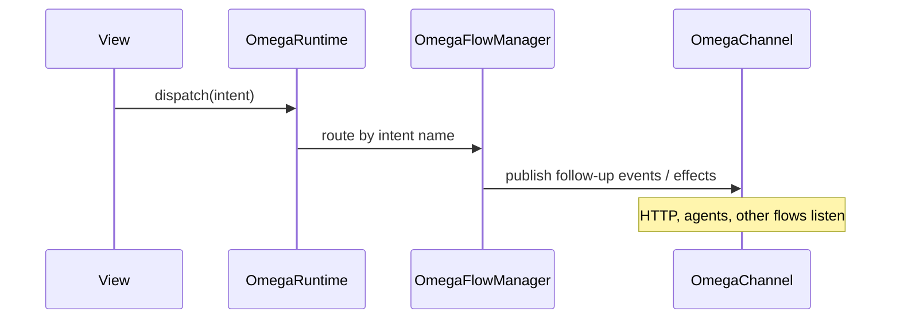

<h1 align="center">AbeyJs</h1>

<p align="center">
  
  
</p>

**AbeyJs** is a **modular development framework** for building **behavior-rich** web applications with **TypeScript or JavaScript**, shipped as **`@abeyjs/*`** packages.

The stack is **opinionated**: **one observable channel**, **explicit intents**, an **`OmegaRuntime`** composition root, **flows/agents**, **HTTP that publishes correlated traffic on that channel**, and **views on standard DOM** (compiled OM templates, custom elements, and imperative mounts). It stays **modular**: **no mandatory third-party view runtime**, and **you compose only the packages you need** from **`@abeyjs/*`**.

This repo is the **official monorepo**: each folder under `packages/` is a publishable **`@abeyjs/<name>`** module.

---

## Table of contents

- [Who is it for?](#who-is-it-for)
- [Core ideas](#core-ideas)
- [Quick glossary](#quick-glossary)
- [Layers and mental order](#layers-and-mental-order)
- [Typical app creation flow](#typical-app-creation-flow)
- [Detailed package map](#detailed-package-map)
- [Two OpenAPI paths](#two-openapi-paths)
- [OM templates and compiler](#om-templates-and-compiler)
- [Development inspector](#development-inspector)
- [DOM safety](#dom-safety)
- [Working in this monorepo](#working-in-this-monorepo)
- [Handy scripts (root `package.json`)](#handy-scripts-root-packagejson)
- [Extra documentation](#extra-documentation)
- [Diagrams](#diagrams)
- [License and contribution](#license-and-contribution)

---

## Who is it for?

- Teams wanting **one mental model**: *something happens in the app → it is published on the channel and/or triggers an intent → flows and agents react → the UI updates*.
- Teams with a **REST API described by OpenAPI** who want to **trim repetitive table/form work** aligned with that contract (**`@abeyjs/openapi`** + CLI).
- Projects prioritizing **plain HTML/CSS**, a **modern bundler** (Vite recommended), and **encapsulated components** without taking on someone else’s UI ecosystem.

---

## Core ideas

| Idea | Meaning |
|------|---------|
| **Single observable channel** | `OmegaChannel` centralizes named events, metadata (`correlationId`, `timestamp`, `source`), and listeners. HTTP, routing, agents, and flows may all publish on the same bus. |
| **Explicit intent** | A command with a stable name and optional payload (**`Intent`**). Screens and buttons “do something” by dispatching intents instead of burying logic in DOM structure. |
| **Flows as reactions** | **`OmegaFlowManager`** registers handlers by intent name and chains side effects (UI messages, follow-up actions, …). |
| **Agents with behavior + view-ish state** | Encapsulate rules (**`OmegaAgentBehaviorEngine`**) and usually expose **`StateCell`** so list/form adapters update. |
| **Runtime as composition root** | **`OmegaRuntime`** holds channel, flows, **`OmegaContainer`** (very small DI surface), registered agents, optional trace ring (**`getTraceSnapshot`**), **`dispatch` / `onIntent`**. |
| **Views = data → DOM** | List/form definitions, **`mount*`** helpers, or compiled OM screens exporting **`mount(outlet, ctx)`**. |

---

## Quick glossary

- **`OmegaChannel`** — Application bus (**`publish`**, **`on`**, **`onAll`**).
- **`Intent`** / **`intentOf`** — Addressed message the flow router understands (**`runtime.dispatch`**).
- **Flow** — Rule: “when this intent/event arrives, run these steps.”
- **Agent** — Actor with **`id`**, **`connect`** / **`dispose`**, commonly paired with observable state.
- **`OmegaRuntime`** — Live object tying together channel, flows, plugins, DI, agents, and tracing.
- **OM** — **AbeyJs Markup**: **`.view.html`** or **`.abey`** files processed by **`@abeyjs/compiler`**.
- **`StateCell`** — Single-slot observable (**`@abeyjs/state`** package); views often **`subscribe`** for repaint.

---

## Layers and mental order

Reading packages “inside-out,” the dependency story often looks like:

```text
@abeyjs/core  →  @abeyjs/state · @abeyjs/validation
       →  @abeyjs/flows · @abeyjs/agents
       →  @abeyjs/runtime
       →  @abeyjs/http
       →  @abeyjs/uikit  (+ peer zod)
       →  @abeyjs/view    (depends on runtime + uikit + …)
       →  @abeyjs/openapi (runtime + http + agents + …)
@abeyjs/compiler  (parse5/esbuild — optional Vite hook for OM)
@abeyjs/cli       (scaffolds projects + OpenAPI + ecosystem slices)
@abeyjs/inspector (ws hub + browser bridge; watches channel/trace)
```

With **workspace** tooling you rarely publish each tarball separately locally; example apps can depend by path/version like any workspace package.

---

## Typical app creation flow

1. **`abeyjs new`** (CLI) copies an **admin** or **`empty`** starter (`packages/cli/templates/`), including **`package.json`**, Vite, and **`omegaSetup.ts`** with **`createOmega()`** (use **`--template abeyjs`** or **`--template empty`** for the OM starter).
2. **`main.ts`** typically combines **`registerAbeyJsUi()`**, **`bootstrapOmegaApp`**, and the **theme stylesheet** (`@abeyjs/view/theme/omega-default.css`).
3. **`routes.ts`** wires **`componentRoute`**, **`pageRoute`**, **`lazyViewMount`**, etc., to **`AppRoute`** entries.
4. OM screens import **`?raw`** or use **`abeyVitePlugin()`** so **`.view.html`/`.abey`** compile during dev/build.
5. Reusable orchestration attaches via **`runtime.onIntent`**, flows/agents, and **`createOmegaHttp({ channel: runtime.channel, … })`** so HTTP publishes **`CH_HTTP_*`** alongside other bus traffic.

**Production deploy:** **`npm run build`** → **`dist/`** static hosting with an SPA **`index.html` fallback**. AbeyJs-specific notes (**`/abey-styles.js`**, **`pathnameBase`** when **`base` ≠ `/`) are in **`[docs/quick-start.md § Deploy](docs/quick-start.md#deploy-your-app-production)`**.

Template variants and **`--shell appbar`** for admin live in [**`packages/cli/templates/README.md`**](packages/cli/templates/README.md).

---

## Detailed package map

| Package | Responsibility | Dive deeper |
|---------|----------------|-------------|
| **`@abeyjs/core`** | Intents, name-typed channel, correlation-aware events, listener helpers—the messaging backbone. | [`packages/core/README.md`](packages/core/README.md) |
| **`@abeyjs/state`** | **`StateCell<T>`**: one value with **`get`/`set`/`subscribe`**, no external store library required. | [`packages/state/README.md`](packages/state/README.md) |
| **`@abeyjs/validation`** | Re-export **`z`** + **`safeParseWithErrors`** plus flat/dotted field error maps (**Zod *peer***). | [`packages/validation/README.md`](packages/validation/README.md) |
| **`@abeyjs/flows`** | **`OmegaFlowManager`**, **`registerHandler`** (wrapped by **`runtime.onIntent`**). | [`packages/flows/README.md`](packages/flows/README.md) |
| **`@abeyjs/agents`** | Stateful agents + reusable behavior engine primitives. | [`packages/agents/README.md`](packages/agents/README.md) |
| **`@abeyjs/runtime`** | **`OmegaRuntime`**, plugins, **`registerModule`/`registerAgent`**, trace ring (**~2000** events max), optional URL↔intent bridge. **`StateCell` is *not*** here — use **`@abeyjs/state`**. | [`packages/runtime/README.md`](packages/runtime/README.md) |
| **`@abeyjs/http`** | **`createOmegaHttp`**: JSON helpers, interceptors, optional GET cache, **`CH_HTTP_*`** publishes carrying **`correlationId`**. | [`packages/http/README.md`](packages/http/README.md) |
| **`@abeyjs/compiler`** | **`compileAbeyToTs`**, **`abeyVitePlugin`**, virtual **`virtual:abeyjs-abey:*`**, **`abey.json`** global styles. | [`packages/compiler/README.md`](packages/compiler/README.md) |
| **`@abeyjs/uikit`** | **`abey-*` controls, **`mountFormView`**, table, line-items helpers, `configpath` global registry helpers. | [`packages/uikit/README.md`](packages/uikit/README.md) |
| **`@abeyjs/view`** | Routed shell, **`bootstrapOmegaApp`**, **`@AbeyComponent`**, re-exported form mount from UI kit, signals, sanitized HTML (**`AbeyJs.sanitize`**), **`lazyViewMount`**. | [`packages/view/README.md`](packages/view/README.md) |
| **`@abeyjs/openapi`** | **`discoverFirstCrud` / `discoverAllCrud`**, **`registerOpenApiCrud`**, **`DynamicCrudAgent`**, **`mountOpenApiCrudView`** — typed list/create/update/delete intents when the OpenAPI routes match discovery heuristics. | [`packages/openapi/README.md`](packages/openapi/README.md) |
| **`@abeyjs/inspector`** | Node **`ws`** hub + **`connectOmegaInspectorAppBridge`** (**`channel.onAll`**, optional bootstrap from **`getTraceSnapshot`**). | [`packages/inspector/README.md`](packages/inspector/README.md) |
| **`@abeyjs/cli`** | **`abeyjs init`**, **`add openapi`**, **`connect`**, **`generate views`**, **`generate ecosystem`**, **`codegen`**. | [`packages/cli/README.md`](packages/cli/README.md) |

---

## Two OpenAPI paths

1. **Runtime path**: fetch or read the JSON spec once, then **`registerOpenApiCrud({ spec, runtime, http })`** (or **`registerOpenApiAllCrud`**). The agent wires intents **`EntityName/List`**, **`Create`**, optional **`Update`/`Delete`** when **`/{id}`** item routes appear in the document.

2. **Design-time (CLI) path**: **`abeyjs connect`** writes **`.abeyjs/connect.json`** + **`abeyjs.connect.yml`**, then **`abeyjs generate views`** emits UI/scaffold bundles from that contract. See **`buildConnectContract`** at [**`packages/cli/src/openapi-contract.ts`**](packages/cli/src/openapi-contract.ts).

They can coexist—the first is fastest for prototyping; the second for larger scaffolding.

---

## OM templates and compiler

- Syntax + compiler pipeline: [**`packages/compiler/README.md`**](packages/compiler/README.md).
- Short orientation linking into the compiler: [**`docs/abey-templates.md`**](docs/abey-templates.md).
- **`abey-table`**: [**`docs/abey-table.md`**](docs/abey-table.md).

Configure Vite **`plugins`** with **`abeyVitePlugin()`** so **`import`** of **`.view.html`/`.abey`** resolves to JS modules. **`abey.json`** global-style wiring is documented in the compiler README.

---

## Development inspector

1. Start the relay: **`npm -w @abeyjs/inspector run hub`** (or **`abeyjs-inspector-hub`** after **`npm run build -w @abeyjs/inspector`**).

2. In the browser app (guard for **`window`**), **`connectOmegaInspectorAppBridge(runtime, { url, appId })`** forwards **`OmegaChannel`** traffic.

3. A separate UI (**e.g. `examples/abeyjs-inspector`**) joins as **`inspector`** via **`WebSocket`** and listens for **`trace`** / **`trace/snapshot`** payloads.

Excellent for inspecting HTTP↔intent↔navigation correlation beyond raw console logs.

---

## DOM safety

Declarative **`@abeyjs/view`** helpers avoid blindly piping untrusted strings into **`innerHTML`**. Rich HTML from runtime data belongs behind **`AbeyJs.sanitize`** / **`setSanitizedHtml`** — see [**`docs/security-abeyjs.md`**](docs/security-abeyjs.md).

**`PageViewSpec`** pages intentionally stick to **`textContent`**.

---

## Working in this monorepo

```bash
git clone <your-repo>
cd AbeyJs
npm install
npm run build
```

Root **`npm run build`** sequences **`@abeyjs/*`** package builds per **`package.json › scripts.build`**.

Folders **`examples/*`** host runnable demos (`npm run example:starter`, etc.—see root **`package.json`**).

---

## Handy scripts (root `package.json`)

| Script | What it helps with |
|--------|---------------------|
| **`npm run build`** | Compiles all AbeyJs packages listed in that script chain. |
| **`npm run abeyjs:new`** | Builds **`@abeyjs/cli`** and runs **`init`** for a starter project. |
| **`npm run abeyjs:new:appbar`** | Admin shell with **`dashboardLayout: false`** (compact chrome). |
| **`npm run abeyjs:add:openapi`** | Patches an existing repo with deps + proxies + stubs for OpenAPI. |
| **`npm run abeyjs:connect`** / **`abeyjs:generate:views`** | CLI contract → codegen path (routing/provenance spelled out in **`packages/cli/README.md`**). |
| **`npm run abeyjs:generate:ecosystem`** | Vertical slice sample (agent + flow + view + intents). |

---

## Extra documentation

| Doc | Covers |
|-----|--------|
| [**`docs/quick-start.md`**](docs/quick-start.md) | **`abeyjs init`** layout, must-have imports, **production deploy** (Vite **`dist/`**, SPA fallback, subpath **`base`**, **`pathnameBase`**) |
| [**`docs/vision-abeyjs.md`**](docs/vision-abeyjs.md) | Product matrix coverage, CSS policy, directional roadmap *(some sections Spanish today)* |
| [**`docs/crud-automatico-abeyjs.md`**](docs/crud-automatico-abeyjs.md) | OpenAPI-assisted CRUD |
| [**`docs/entidad-modelo-y-formularios.md`**](docs/entidad-modelo-y-formularios.md) | Entity ↔ forms |
| [**`docs/abey-table-flows.md`**](docs/abey-table-flows.md) | OM tables + flows |

Each **`packages/*/README.md`** plus source **JSDoc** remain the deep reference when implementing features.

---

## Diagrams

### Layers (conceptual deps)



### Intent dispatch (simplified)



---

## License and contribution

AbeyJs is released under the **[MIT License](LICENSE)** (SPDX: `MIT`). The copyright and attribution for this codebase are **solely to AbeyJs** (see the notice in `LICENSE`).

Every workspace **`package.json`** under **`packages/`**, **`examples/`**, and **`packages/cli/templates/*`** declares **`"license": "MIT"`** for consistency with the root **`LICENSE`**. Before publishing **`@abeyjs/*`** tarballs to a registry, confirm your process still ships the license text alongside the code per your legal review.

To contribute:

1. Prefer **scoped** changes with matching package **README** updates when behavior shifts.
2. Run **`npm run build`** before merging to ensure the TypeScript graph still compiles.

---

**Next step:** open the [**CLI README**](packages/cli/README.md) to scaffold projects or wire OpenAPI; open the [**runtime README**](packages/runtime/README.md) if you start from **`createOmega`** and intent dispatch.
